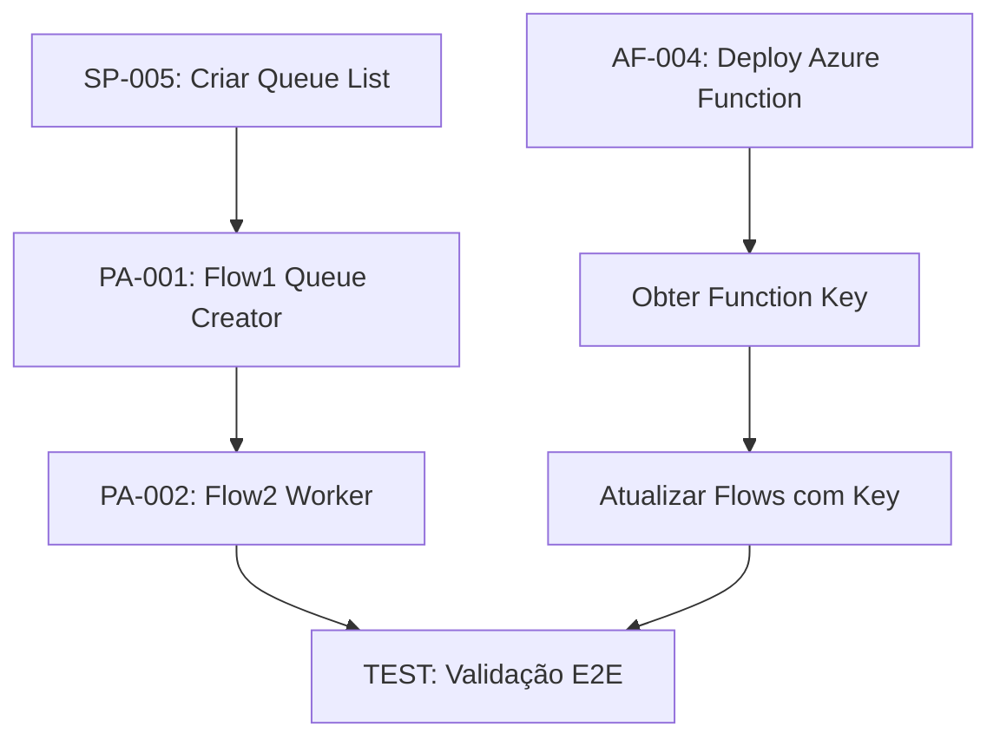

# 📋 CONTRATO DE ENTREGÁVEIS
## Projeto: Sharepoint_JIRA Integration

**Data:** 2025-12-28  
**Versão:** 1.0  
**Status:** Em Execução

---

## 🎯 OBJETIVO

Garantir entrega 100% de todos os componentes do pipeline automatizado JIRA → SharePoint → Teams/Power BI.

---

## 📦 ENTREGÁVEIS OBRIGATÓRIOS

### 1. AZURE FUNCTION

| # | Entregável | Critério de Aceite | Status | Responsável |
|---|------------|-------------------|--------|-------------|
| 1.1 | `function_app.py` com 18 endpoints | Arquivo existe, >100KB, todos endpoints documentados | ✅ ENTREGUE | AI Agent |
| 1.2 | `requirements.txt` | Contém azure-functions, pandas, numpy | ✅ ENTREGUE | AI Agent |
| 1.3 | `host.json` configurado | v2.0, extensionBundle 4.x | ✅ ENTREGUE | AI Agent |
| 1.4 | Deploy no Azure | `/api/health` retorna `{"status":"healthy"}` | ✅ ENTREGUE | Human |
| 1.5 | App Settings configurados | PBI_TENANT_ID, PBI_CLIENT_ID, PBI_CLIENT_SECRET | ✅ ENTREGUE | Human |
| 1.6 | Function Key obtida | Chave copiada para uso nos Flows | ✅ ENTREGUE | Human |

**Comando de Deploy:**
```powershell
cd D:\VMs\Projetos\JIRA_Teams_PBI_Integration\AzureFunction
func azure functionapp publish func-pipeline-consolidation
```

---

### 2. SHAREPOINT LISTS

| # | Entregável | Critério de Aceite | Status | Responsável |
|---|------------|-------------------|--------|-------------|
| 2.1 | Schema `Ofertas_Pipeline` exportado | XML válido com todos campos | ✅ ENTREGUE | AI Agent |
| 2.2 | Schema `ARQs_Teams` exportado | XML válido | ✅ ENTREGUE | AI Agent |
| 2.3 | Schema `StatusReports_Historico` exportado | XML válido | ✅ ENTREGUE | AI Agent |
| 2.4 | FillInChoice=TRUE nos campos Choice | Status, Mercado, TipoServico aceita valores livres | ✅ ENTREGUE | Human (UI) |
| 2.5 | Lista `StatusReports_Queue` criada | 12 colunas incluindo UniqueKey com enforce unique | ⏳ PENDENTE | Human |

**Comando de Criação:**
```powershell
cd D:\VMs\Projetos\Sharepoint_JIRA\MD_Files
.\Create_StatusReports_Queue_Columns.ps1
```

---

### 3. POWER AUTOMATE FLOWS

| # | Entregável | Critério de Aceite | Status | Responsável |
|---|------------|-------------------|--------|-------------|
| 3.1 | Guia Flow1 (Queue Creator) | Documento .md com step-by-step completo | ✅ ENTREGUE | AI Agent |
| 3.2 | Guia Flow2 (Worker) | Documento .md com step-by-step completo | ✅ ENTREGUE | AI Agent |
| 3.3 | Guia Flow3 (Monitor - Opcional) | Documento .md com step-by-step | ✅ ENTREGUE | AI Agent |
| 3.4 | Adaptive Card JSON v1.4 | JSON válido com todos campos | ✅ ENTREGUE | AI Agent |
| 3.5 | Flow1 criado no Power Automate | Trigger funcional, cria items na Queue | ⏳ PENDENTE | Human |
| 3.6 | Flow2 criado no Power Automate | Processa items, envia cards, persiste respostas | ⏳ PENDENTE | Human |

---

### 4. DOCUMENTAÇÃO

| # | Entregável | Critério de Aceite | Status | Responsável |
|---|------------|-------------------|--------|-------------|
| 4.1 | `DEPLOY_CHECKLIST.md` | Checklist completo de deploy | ✅ ENTREGUE | AI Agent |
| 4.2 | `DEPLOY_GUIDE.md` | Comandos de deploy documentados | ✅ ENTREGUE | AI Agent |
| 4.3 | `DISASTER_RECOVERY_GUIDE.md` | Procedimento de recuperação completo | ✅ ENTREGUE | AI Agent |
| 4.4 | `STAKEHOLDER_PROJECT_GUIDE.md` | Guia para stakeholders não técnicos | ✅ ENTREGUE | AI Agent |
| 4.5 | `QUEUE_WAIT_TEST_PLAN.md` | Plano de testes E2E | ✅ ENTREGUE | AI Agent |
| 4.6 | `CHECKPOINT.json` | Source of truth com todas tasks | ✅ ENTREGUE | AI Agent |

---

### 5. TESTES E VALIDAÇÃO

| # | Entregável | Critério de Aceite | Status | Responsável |
|---|------------|-------------------|--------|-------------|
| 5.1 | Test A: Queue Creation | Flow1 cria items, UniqueKey funciona | ⏳ PENDENTE | Human |
| 5.2 | Test B: Worker Response | Card recebido no Teams, resposta persistida | ⏳ PENDENTE | Human |
| 5.3 | Test C: Validação Red Status | Status Vermelho sem observação gera Error | ⏳ PENDENTE | Human |
| 5.4 | Validação E2E completa | Fluxo completo JIRA→SharePoint→Teams | ⏳ PENDENTE | Human |

---

## 📊 RESUMO DE STATUS

| Categoria | Total | Entregue | Pendente | % Completo |
|-----------|-------|----------|----------|------------|
| Azure Function | 6 | 3 | 3 | 50% |
| SharePoint Lists | 5 | 4 | 1 | 80% |
| Power Automate | 6 | 4 | 2 | 67% |
| Documentação | 6 | 6 | 0 | 100% |
| Testes | 4 | 0 | 4 | 0% |
| **TOTAL** | **27** | **17** | **10** | **63%** |

---

## ⚠️ DEPENDÊNCIAS CRÍTICAS



---

## 🚀 ORDEM DE EXECUÇÃO

| Prioridade | Ação | Tempo Estimado | Bloqueador |
|------------|------|----------------|------------|
| **1** | Criar lista StatusReports_Queue | 5 min | Nenhum |
| **2** | Deploy Azure Function | 10 min | Nenhum |
| **3** | Configurar App Settings no Azure | 5 min | Deploy |
| **4** | Obter Function Key | 2 min | Deploy |
| **5** | Criar Flow1 no Power Automate | 30 min | Lista criada |
| **6** | Criar Flow2 no Power Automate | 45 min | Flow1 pronto |
| **7** | Executar Test Plan | 15 min | Flows prontos |

**Tempo Total Estimado:** ~2 horas

---

## ✅ CRITÉRIOS DE ACEITE FINAL

O projeto estará **100% entregue** quando:

1. [ ] `/api/health` retorna `{"status":"healthy"}` no Azure
2. [ ] Lista `StatusReports_Queue` existe no SharePoint com UniqueKey unique
3. [ ] Flow1 cria items na queue automaticamente (Tue/Fri 09:00)
4. [ ] Flow2 envia Adaptive Card no Teams 1:1 chat
5. [ ] Respostas do card são persistidas em `StatusReports_Historico`
6. [ ] `Ofertas_Pipeline` é atualizada com SemanaReport/VersaoReport
7. [ ] Test Plan executado com 100% sucesso

---

## 📝 REGISTRO DE ALTERAÇÕES

| Data | Versão | Alteração | Por |
|------|--------|-----------|-----|
| 2025-12-28 | 1.0 | Criação inicial do contrato | AI Agent |

---

*Este documento serve como contrato formal de entregáveis do projeto.*  
*Atualizar CHECKPOINT.json sempre que um item for concluído.*
