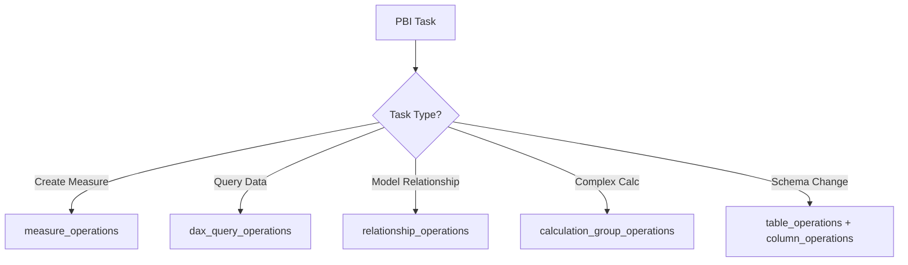
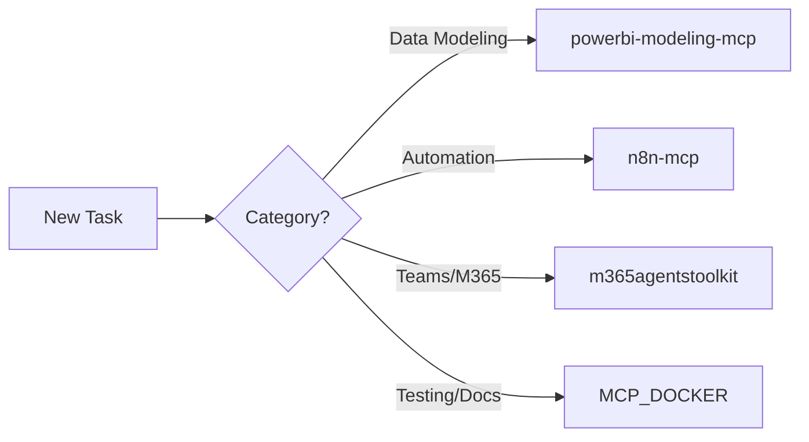

# 🚀 MCP Skills Integration Guide
## Advanced Tool Engagement for Innovation 2026

**Version:** 1.0  
**Date:** 2026-01-06  
**Project:** JIRA → SharePoint → Teams/Power BI Integration

---

## 🎯 Executive Summary

This project leverages **Model Context Protocol (MCP) Servers** as primary external tool helpers, enabling advanced capabilities beyond standard development. MCP servers provide specialized skills that are engaged based on task type.

---

## 📦 Available MCP Servers

| Server | Primary Use | When to Engage |
|--------|-------------|----------------|
| **powerbi-modeling-mcp** | Power BI semantic modeling, DAX, measures | Dashboard development, DAX queries |
| **n8n-mcp** | Workflow automation, n8n operations | Flow design, automation patterns |
| **m365agentstoolkit** | Microsoft 365/Teams development | Teams cards, Copilot extensions |
| **MCP_DOCKER** | Browser automation, n8n nodes, MS docs | Testing, node discovery, documentation |

---

## 1. Power BI Modeling MCP

### Purpose
Direct manipulation of Power BI semantic models without desktop application.

### Key Capabilities

| Tool | Description | Use Case |
|------|-------------|----------|
| `connection_operations` | Connect to PBI Desktop/Fabric | Setup connections |
| `measure_operations` | Create/Update/Delete measures | DAX measure management |
| `table_operations` | Manage tables | Schema changes |
| `column_operations` | Manage columns | Data modeling |
| `relationship_operations` | Create relationships | Data model design |
| `dax_query_operations` | Execute DAX queries | Testing, validation |
| `calculation_group_operations` | Manage calculation groups | Advanced DAX patterns |

### When to Engage



### Example: Creating a Win Rate Measure

```json
{
  "operation": "Create",
  "tableName": "Ofertas_Pipeline",
  "createDefinition": {
    "name": "WinRate_30d",
    "expression": "VAR WonCount = CALCULATE(COUNTROWS(Ofertas_Pipeline), Ofertas_Pipeline[Status]=\"Won\", Ofertas_Pipeline[DataResultado] >= TODAY()-30) VAR LostCount = CALCULATE(COUNTROWS(Ofertas_Pipeline), Ofertas_Pipeline[Status]=\"Lost\", Ofertas_Pipeline[DataResultado] >= TODAY()-30) RETURN DIVIDE(WonCount, WonCount + LostCount, 0)",
    "formatString": "0.0%"
  }
}
```

---

## 2. n8n MCP

### Purpose
Workflow automation design and management via n8n platform.

### Key Capabilities

| Tool | Description | Use Case |
|------|-------------|----------|
| `search_nodes` | Find n8n nodes by keyword | Discover automation options |
| `get_node_essentials` | Get node configuration | Implementation details |
| `validate_workflow` | Validate workflow JSON | Pre-deployment check |
| `list_ai_tools` | 263 AI-capable nodes | AI workflow design |
| `search_templates` | Find workflow templates | Pattern discovery |

### When to Engage

- **Designing new workflows** → `search_nodes`, `get_node_essentials`
- **Validating before deploy** → `validate_workflow`
- **AI integration** → `list_ai_tools`, `ai_agents_guide`
- **Finding patterns** → `search_templates`, `get_templates_for_task`

### Example: Finding SharePoint Nodes

```
search_nodes(query: "sharepoint", includeExamples: true)
```

---

## 3. Microsoft 365 Agents Toolkit

### Purpose
Microsoft Teams, Microsoft 365 Copilot, and agent development.

### Key Capabilities

| Tool | Description | Use Case |
|------|-------------|----------|
| `get_knowledge` | M365/Copilot development docs | Architecture guidance |
| `get_code_snippets` | SDK implementation examples | Code patterns |
| `get_schema` | Manifest schemas | App/agent configuration |
| `troubleshoot` | Error resolution | Debugging |

### When to Engage

- **Teams Adaptive Card design** → `get_knowledge("adaptive cards")`
- **Bot development** → `get_code_snippets("botbuilder")`
- **Manifest creation** → `get_schema("app_manifest", "latest")`
- **API issues** → `troubleshoot("error description")`

---

## 4. MCP_DOCKER (Browser + n8n + MS Docs)

### Purpose
Browser automation, n8n node documentation, Microsoft documentation search.

### Key Capabilities

| Tool Category | Tools | Use Case |
|---------------|-------|----------|
| **Browser** | `browser_navigate`, `browser_click`, `browser_snapshot` | UI testing |
| **n8n Nodes** | `list_nodes`, `get_node_info`, `validate_node_operation` | Node configuration |
| **MS Docs** | `microsoft_docs_search`, `microsoft_docs_fetch` | Official documentation |

### When to Engage

- **End-to-end testing** → Browser tools for UI validation
- **Node configuration** → n8n node tools for accurate setup
- **Official guidance** → Microsoft docs for authoritative information

---

## 🎯 Task-to-Skill Matrix

| Task Type | Primary MCP | Secondary MCP |
|-----------|-------------|---------------|
| Power BI Dashboard | **powerbi-modeling-mcp** | MCP_DOCKER (MS docs) |
| DAX Measure Creation | **powerbi-modeling-mcp** | - |
| Workflow Automation | **n8n-mcp** | MCP_DOCKER |
| Teams Adaptive Cards | **m365agentstoolkit** | MCP_DOCKER |
| End-to-End Testing | **MCP_DOCKER** (browser) | - |
| Documentation Lookup | **MCP_DOCKER** (MS docs) | m365agentstoolkit |
| Semantic Modeling | **powerbi-modeling-mcp** | - |

---

## 🔄 Engagement Protocol

### Step 1: Identify Task Category



### Step 2: Engage Primary Skill

1. Use the appropriate MCP server tool
2. Validate output
3. Iterate as needed

### Step 3: Cross-Reference (Optional)

- Use secondary MCP for validation
- Consult MS docs for official patterns

---

## 📋 Project-Specific Skill Mapping

### For This Project's Components

| Component | MCP Server | Primary Tools |
|-----------|------------|---------------|
| Executive Dashboard | powerbi-modeling-mcp | `measure_operations`, `dax_query_operations` |
| Architect Dashboard | powerbi-modeling-mcp | `relationship_operations`, `table_operations` |
| C-Level Adaptive Card | m365agentstoolkit | `get_knowledge`, `get_schema` |
| Power Automate Flows | n8n-mcp | `search_nodes`, `validate_workflow` |
| E2E Testing | MCP_DOCKER | `browser_*` tools |

---

## ⚠️ Important Guidelines

> [!CAUTION]
> **No Deployments Without Authorization**
> All MCP operations that modify production systems require explicit written approval.

> [!IMPORTANT]
> **Skill Selection Priority**
> 1. Always select the most specialized MCP for the task
> 2. Use secondary MCPs for cross-validation only
> 3. Document skill usage in task artifacts

> [!TIP]
> **Efficiency Pattern**
> Start with `get_*` or `list_*` operations to understand available options before executing changes.

---

## 🚀 Innovation 2026 Commitment

This project demonstrates cutting-edge integration of:
- **AI-Assisted Development** via MCP server orchestration
- **Cross-Platform Automation** combining Power BI, Teams, and SharePoint
- **Skill-Based Task Assignment** for optimal tool-to-task matching

---

*Document: MCP_SKILLS_INTEGRATION_GUIDE.md*  
*Project: JIRA → SharePoint → Teams/Power BI Integration*
