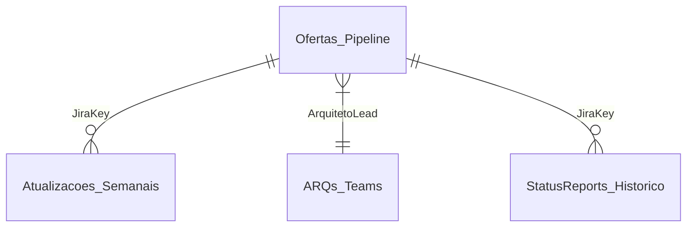

# 📊 Power BI Connection Guide
## SharePoint Lists Integration

**Version:** 1.0  
**Date:** 2026-01-06  
**Status:** Implementation Guide

---

## 🎯 Objective

Connect Power BI to SharePoint Lists for real-time dashboards and scheduled data refresh.

---

## 📋 Prerequisites

| Requirement | Details |
|-------------|---------|
| **Power BI Desktop** | Latest version installed |
| **Power BI Pro License** | Required for publishing to workspace |
| **SharePoint Access** | Read access to target lists |
| **Microsoft 365 Account** | Same tenant as SharePoint |

---

## 1. Connect Power BI Desktop to SharePoint Lists

### Step 1.1: Open Power BI Desktop

1. Launch **Power BI Desktop**
2. Click **Get Data** → **More...**
3. Search for **SharePoint Online List**
4. Click **Connect**

### Step 1.2: Enter SharePoint Site URL

```
https://proz365.sharepoint.com/sites/PreSales_Pipeline
```

> [!IMPORTANT]
> Use the **site URL**, not the list URL. Do not include `/Lists/` or the list name in the URL.

### Step 1.3: Authentication

1. Select **Microsoft Account** (recommended)
2. Click **Sign In**
3. Use your Microsoft 365 credentials
4. Click **Connect**

### Step 1.4: Select SharePoint Lists

Select the following lists to connect:

| List Name | GUID | Purpose |
|-----------|------|---------|
| `Ofertas_Pipeline` | `6db5a12d-595d-4a1a-aca1-035837613815` | Main pipeline data |
| `Atualizacoes_Semanais` | `172d7d29-5a3c-4608-b4ea-b5b027ef5ac0` | Weekly status updates |
| `ARQs_Teams` | `1ad529f7-db5b-4567-aa00-1582ff333264` | Architect master data |
| `StatusReports_Historico` | `f58b3d23-5750-4b29-b30f-a7b5421cdd80` | Historical reports |

Click **Load** to import data.

---

## 2. Data Transformation (Power Query)

### Step 2.1: Open Power Query Editor

1. Click **Transform Data** in the Home ribbon
2. For each table, apply the following transformations:

### Step 2.2: Ofertas_Pipeline Transformations

```powerquery
let
    Source = SharePoint.Tables("https://proz365.sharepoint.com/sites/PreSales_Pipeline", [ApiVersion = 15]),
    Ofertas_Pipeline = Source{[Title="Ofertas_Pipeline"]}[Items],
    
    // Remove system columns
    #"Removed Columns" = Table.RemoveColumns(Ofertas_Pipeline,
        {"FileSystemObjectType", "ServerRedirectedEmbedUri", 
         "ServerRedirectedEmbedUrl", "ContentTypeId", "ComplianceAssetId",
         "OData__ColorTag", "GUID", "ID", "Modified", "Created"}),
    
    // Change data types
    #"Changed Type" = Table.TransformColumnTypes(#"Removed Columns",{
        {"JiraKey", type text},
        {"Cliente", type text},
        {"Status", type text},
        {"Mercado", type text},
        {"DataEntrada", type date},
        {"ValorTCV", Currency.Type},
        {"HorasBudget", type number}
    })
in
    #"Changed Type"
```

### Step 2.3: Key Column Mappings

| SharePoint Column | Power BI Column | Data Type |
|-------------------|-----------------|-----------|
| `JiraKey` | JiraKey | Text |
| `Cliente` | Cliente | Text |
| `Status` | Status | Text |
| `Mercado` | Mercado | Text |
| `ValorTCV` | ValorTCV | Currency |
| `HorasBudget` | HorasBudget | Decimal |
| `DataEntrada` | DataEntrada | Date |
| `ArquitetoLead` | ArquitetoLead | Text |

---

## 3. Data Model Configuration

### Step 3.1: Create Relationships



| From Table | From Column | To Table | To Column | Cardinality |
|------------|-------------|----------|-----------|-------------|
| `Ofertas_Pipeline` | JiraKey | `Atualizacoes_Semanais` | JiraKey | 1:N |
| `Ofertas_Pipeline` | ArquitetoLead | `ARQs_Teams` | ArqDisplay | N:1 |
| `Ofertas_Pipeline` | JiraKey | `StatusReports_Historico` | JiraKey | 1:N |

### Step 3.2: Create Date Table (DAX)

```dax
DateTable = 
ADDCOLUMNS(
    CALENDAR(DATE(2024,1,1), DATE(2026,12,31)),
    "Year", YEAR([Date]),
    "Quarter", "Q" & FORMAT([Date], "Q"),
    "Month", FORMAT([Date], "MMM YYYY"),
    "Week", WEEKNUM([Date]),
    "WeekLabel", "Sem " & WEEKNUM([Date])
)
```

---

## 4. Scheduled Refresh Configuration

### Step 4.1: Publish to Power BI Service

1. Click **Publish** in Power BI Desktop
2. Select target **Workspace**
3. Wait for publish confirmation

### Step 4.2: Configure Gateway (if required)

> [!NOTE]
> SharePoint Online lists do NOT require an On-premises Data Gateway.
> OAuth credentials are stored in the Power BI cloud service.

### Step 4.3: Configure Scheduled Refresh

1. Go to [app.powerbi.com](https://app.powerbi.com)
2. Navigate to your **Workspace**
3. Click the **Settings** icon (⚙️) next to the dataset
4. Expand **Scheduled Refresh**

| Setting | Recommended Value |
|---------|-------------------|
| **Keep data up to date** | On |
| **Refresh frequency** | Daily |
| **Time zone** | (UTC-03:00) Brasilia |
| **Schedule 1** | 08:00 AM |
| **Schedule 2** | 02:00 PM |
| **Schedule 3** | 06:00 PM |

5. Click **Apply**

### Step 4.4: Configure Data Source Credentials

1. In dataset settings, expand **Data source credentials**
2. Click **Edit credentials** for SharePoint
3. Select **OAuth2** as Authentication method
4. Sign in with Microsoft 365 account
5. Ensure **Privacy level** is set to **Organizational**

---

## 5. API-Triggered Refresh (Optional)

### Step 5.1: App Registration Prerequisites

For automated refresh triggered by Power Automate or Azure Function, configure:

| Environment Variable | Purpose |
|---------------------|---------|
| `PBI_TENANT_ID` | Azure AD Tenant ID |
| `PBI_CLIENT_ID` | App Registration Client ID |
| `PBI_CLIENT_SECRET` | App Registration Secret |

### Step 5.2: Azure AD App Registration

1. Go to [Azure Portal](https://portal.azure.com) → **Azure Active Directory**
2. Click **App registrations** → **New registration**
3. Name: `PowerBI-Refresh-App`
4. Supported account types: **Single tenant**
5. Click **Register**

### Step 5.3: Configure API Permissions

```
API: Power BI Service
Permissions:
  - Dataset.ReadWrite.All (Delegated)
  - Workspace.ReadWrite.All (Delegated)
```

1. Click **Add a permission**
2. Select **Power BI Service**
3. Choose **Delegated permissions**
4. Add the required permissions
5. Click **Grant admin consent**

### Step 5.4: Create Client Secret

1. Click **Certificates & secrets**
2. Click **New client secret**
3. Description: `PBI-Refresh-Secret`
4. Expiration: **24 months**
5. Copy the secret value immediately (shown only once)

---

## 6. Troubleshooting

### Common Issues

| Issue | Solution |
|-------|----------|
| **"Access denied" on refresh** | Re-authenticate data source credentials in Power BI Service |
| **"Gateway required" error** | SharePoint Online doesn't need gateway; check if list is in SP Online |
| **Refresh fails at specific table** | Check column mappings in Power Query; SharePoint schema may have changed |
| **Slow refresh performance** | Use DirectQuery for large lists or add filter to reduce row count |

### Verify Connection Health

```powershell
# Test SharePoint site accessibility
$site = "https://proz365.sharepoint.com/sites/PreSales_Pipeline"
Invoke-WebRequest -Uri $site -UseDefaultCredentials -Method HEAD
```

---

## 7. Validation Checklist

- [ ] Power BI Desktop connects to SharePoint site
- [ ] All 4 lists load correctly
- [ ] Relationships created between tables
- [ ] Dataset published to Power BI Service
- [ ] Scheduled refresh configured (3x daily)
- [ ] Credentials set to OAuth2/Organizational
- [ ] Test refresh succeeds without errors

---

## 📚 References

| Resource | URL |
|----------|-----|
| Power BI SharePoint Connector | [Microsoft Docs](https://learn.microsoft.com/power-bi/connect-data/service-connect-sharepoint-online-list) |
| Scheduled Refresh | [Microsoft Docs](https://learn.microsoft.com/power-bi/connect-data/refresh-scheduled-refresh) |
| App Registration | [Azure Docs](https://learn.microsoft.com/azure/active-directory/develop/quickstart-register-app) |

---

*Document: POWERBI_CONNECTION_GUIDE.md*  
*Project: JIRA → SharePoint → Teams/Power BI Integration*
