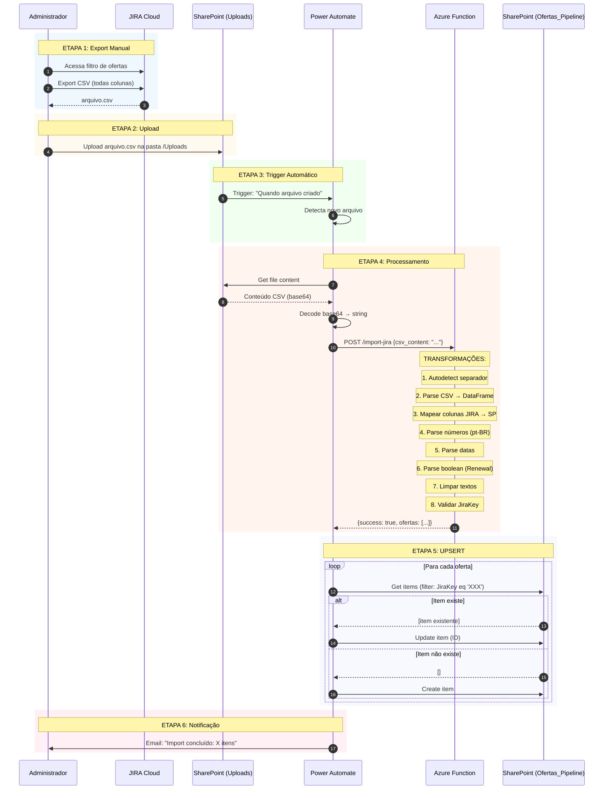
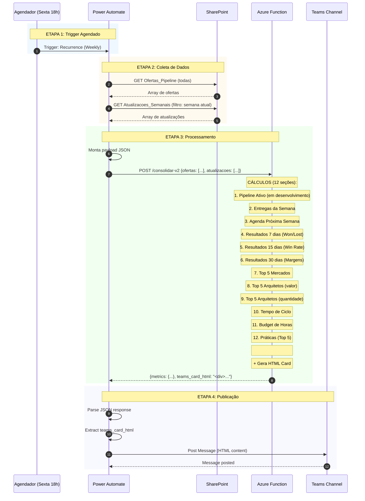
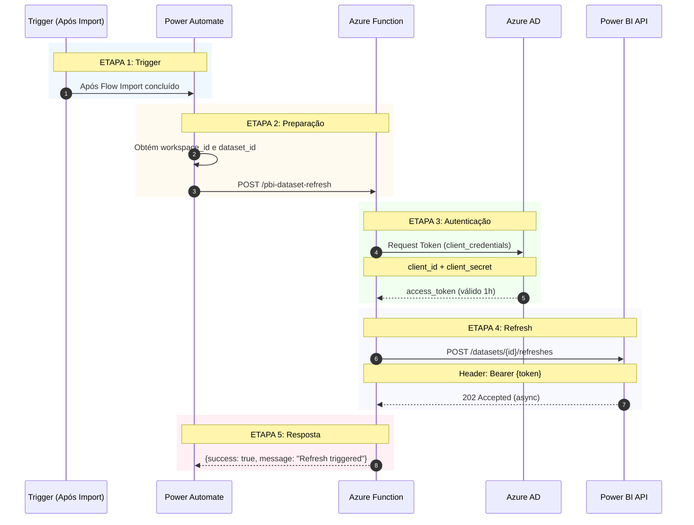
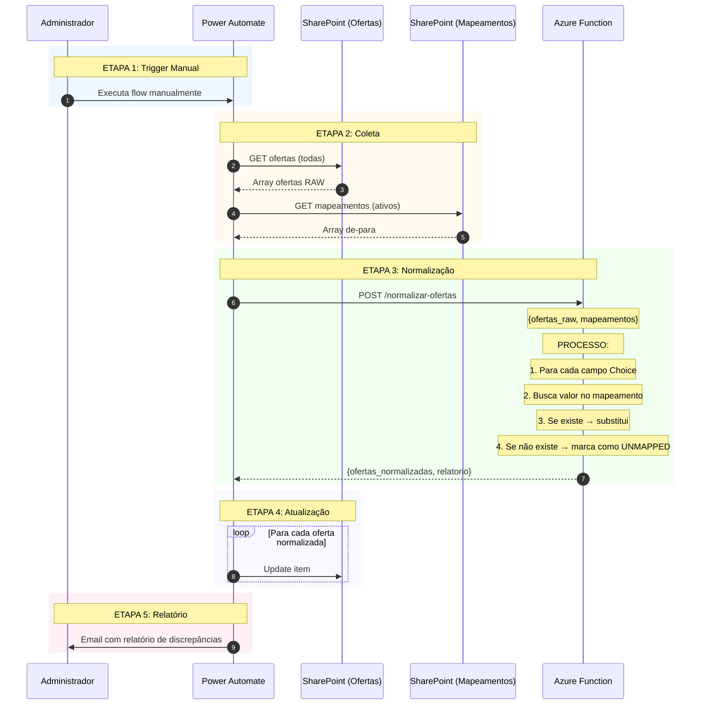

# 🏛️ ARQUITETURA DETALHADA DO SISTEMA
## JIRA → SharePoint → Teams/Power BI Integration

**Versão:** 2.0  
**Data:** 2025-12-27  
**Tipo:** Documento Técnico Deep-Dive

---

## 📑 ÍNDICE

1. [Visão Geral da Arquitetura](#1-visão-geral-da-arquitetura)
2. [Matriz de Conexões](#2-matriz-de-conexões)
3. [Fluxo 1: Importação JIRA](#3-fluxo-1-importação-jira)
4. [Fluxo 2: Consolidação Semanal](#4-fluxo-2-consolidação-semanal)
5. [Fluxo 3: Atualização Power BI](#5-fluxo-3-atualização-power-bi)
6. [Fluxo 4: Normalização (Opcional)](#6-fluxo-4-normalização-opcional)
7. [Justificativas Técnicas](#7-justificativas-técnicas)
8. [Tratamento de Erros](#8-tratamento-de-erros)
9. [Segurança e Autenticação](#9-segurança-e-autenticação)

---

## 1. VISÃO GERAL DA ARQUITETURA

### Diagrama de Componentes

```
┌─────────────────────────────────────────────────────────────────────────────┐
│                           CAMADA DE APRESENTAÇÃO                            │
├─────────────────────────────────────────────────────────────────────────────┤
│                                                                             │
│    ┌───────────────┐        ┌───────────────┐        ┌───────────────┐     │
│    │ Microsoft     │        │   Power BI    │        │   SharePoint  │     │
│    │   Teams       │        │  Dashboard    │        │    Views      │     │
│    │ (Card HTML)   │        │  (Reports)    │        │   (Listas)    │     │
│    └───────┬───────┘        └───────┬───────┘        └───────┬───────┘     │
│            │                        │                        │             │
└────────────┼────────────────────────┼────────────────────────┼─────────────┘
             │                        │                        │
┌────────────┼────────────────────────┼────────────────────────┼─────────────┐
│            │           CAMADA DE ORQUESTRAÇÃO                │             │
├────────────┼────────────────────────┼────────────────────────┼─────────────┤
│            │                        │                        │             │
│            ▼                        ▼                        ▼             │
│    ┌─────────────────────────────────────────────────────────────┐         │
│    │                    POWER AUTOMATE                           │         │
│    │  ┌─────────────┐  ┌─────────────┐  ┌─────────────┐         │         │
│    │  │   Flow 1    │  │   Flow 2    │  │   Flow 3    │         │         │
│    │  │ JIRA Import │  │ Atualizacoes│  │ Weekly Rep. │         │         │
│    │  └─────────────┘  └─────────────┘  └─────────────┘         │         │
│    └─────────────────────────────────────────────────────────────┘         │
│                                  │                                          │
└──────────────────────────────────┼──────────────────────────────────────────┘
                                   │
┌──────────────────────────────────┼──────────────────────────────────────────┐
│                                  │      CAMADA DE PROCESSAMENTO             │
├──────────────────────────────────┼──────────────────────────────────────────┤
│                                  ▼                                          │
│    ┌─────────────────────────────────────────────────────────────┐         │
│    │                    AZURE FUNCTION APP                       │         │
│    │  ┌────────────────┐  ┌────────────────┐  ┌──────────────┐  │         │
│    │  │  /import-jira  │  │/consolidar-v2  │  │  /pbi-*      │  │         │
│    │  │  (ETL)         │  │(Métricas+HTML) │  │  (API PBI)   │  │         │
│    │  └────────────────┘  └────────────────┘  └──────────────┘  │         │
│    └─────────────────────────────────────────────────────────────┘         │
│                                                                             │
└─────────────────────────────────────────────────────────────────────────────┘
                                   │
┌──────────────────────────────────┼──────────────────────────────────────────┐
│                                  │         CAMADA DE DADOS                  │
├──────────────────────────────────┼──────────────────────────────────────────┤
│                                  ▼                                          │
│    ┌───────────────┐        ┌───────────────┐        ┌───────────────┐     │
│    │   SharePoint  │        │   Power BI    │        │     JIRA      │     │
│    │    Lists      │◀──────▶│   Datasets    │        │   (Fonte)     │     │
│    │ (Master Data) │        │   (Cache)     │        │               │     │
│    └───────────────┘        └───────────────┘        └───────────────┘     │
│                                                                             │
└─────────────────────────────────────────────────────────────────────────────┘
```

### SharePoint Lists (GUIDs) - ✅ Validated 2025-12-28

| List | GUID | Notes |
|---|---|---|
| `Ofertas_Pipeline` | `6db5a12d-595d-4a1a-aca1-035837613815` | ✅ Used by Flow1/Flow3/Flow4 (and XML export). |
| `Atualizacoes_Semanais` | `172d7d29-5a3c-4608-b4ea-b5b027ef5ac0` | ✅ Used by Flow2 (legacy write) and Flow3 (read). |
| `ARQs_Teams` | `1ad529f7-db5b-4567-aa00-1582ff333264` | ✅ Flow1 references by name. |
| `Ofertas_Pipeline_Normalizada` | `fa90b09d-5eb9-461f-bf15-64a494b00d2d` | ✅ Azure Function/internal. |
| `StatusReports_Historico` | `f58b3d23-5750-4b29-b30f-a7b5421cdd80` | ✅ Used by Flow2 (history write). |
| `StatusReports_Queue_TEST` | `12197c6e-b5d4-4bcd-96d4-c8aafc426d0a` | ✅ 🆕 Queue for Flow1/Flow2. |
| `Budget_Extensions` | `dfeda3e0-0cc9-434d-b8d5-5b450dc071b2` | ✅ Not referenced in flows. |
| `Jira_Allocation_Data` | `f25edf86-f23a-41bb-a7b1-84a096df2dd8` | ✅ Not referenced in flows. |

> 📌 **Referência:** `XML/INDEX.md` | **Validado via:** PnP PowerShell

---

### Componentes do Sistema

| # | Componente | Tecnologia | Função |
|---|------------|------------|--------|
| 1 | **JIRA** | Atlassian Cloud | Fonte primária de dados (ofertas comerciais) |
| 2 | **Azure Function** | Python 3.11 + V2 | Processamento, transformação, cálculo de métricas |
| 3 | **SharePoint Online** | Microsoft 365 | Armazenamento estruturado (banco de dados) |
| 4 | **Power Automate** | Cloud Flow Premium | Orquestração e automação de fluxos |
| 5 | **Microsoft Teams** | Microsoft 365 | Entrega de reports (cards HTML) |
| 6 | **Power BI** | Pro/Premium | Dashboards e visualizações |
| 7 | **Azure AD** | Microsoft Entra | Autenticação e autorização |

---

## 2. MATRIZ DE CONEXÕES

### Quem conecta em quem?

| DE ↓ / PARA → | JIRA | Azure Func | SharePoint | Power Automate | Teams | Power BI | Azure AD |
|---------------|------|------------|------------|----------------|-------|----------|----------|
| **JIRA** | - | CSV Export | - | - | - | - | - |
| **Azure Function** | - | - | JSON→UPSERT | JSON Response | - | REST API | Token |
| **SharePoint** | - | - | - | Trigger/Data | - | Data Source | OAuth |
| **Power Automate** | - | HTTP POST | CRUD, Read | - | Post Card | - | Conn |
| **Teams** | - | - | - | - | - | - | - |
| **Power BI** | - | - | DirectQuery | - | - | - | Token |
| **Azure AD** | - | ✓ | ✓ | ✓ | ✓ | ✓ | - |

### Protocolos de Comunicação

| Conexão | Protocolo | Formato | Autenticação |
|---------|-----------|---------|--------------|
| JIRA → Admin | HTTP Export | CSV | User Session |
| Power Automate → Azure Function | HTTPS REST | JSON | Function Key |
| Power Automate → SharePoint | Graph API | JSON | OAuth 2.0 |
| Power Automate → Teams | Graph API | JSON | OAuth 2.0 |
| Azure Function → Power BI | REST API | JSON | Service Principal |
| Power BI → SharePoint | OData | JSON | OAuth 2.0 |

---

## 3. FLUXO 1: IMPORTAÇÃO JIRA

### Objetivo
Importar dados do JIRA para SharePoint com transformação e validação de tipos.

### Diagrama de Sequência



### Ordem de Execução Detalhada

| # | Ação | Componente | Pré-requisito | Saída |
|---|------|------------|---------------|-------|
| 1 | Export CSV do JIRA | Admin/JIRA | Acesso ao JIRA | arquivo.csv |
| 2 | Upload para SharePoint | Admin | Arquivo CSV | Arquivo na pasta /Uploads |
| 3 | Trigger detecta arquivo | Power Automate | Arquivo criado | Início do flow |
| 4 | Lê conteúdo do arquivo | Power Automate | Trigger ativo | String CSV |
| 5 | Envia para Azure Function | Power Automate | Conteúdo CSV | Request HTTP |
| 6 | Parse e transforma dados | Azure Function | Request válido | JSON com ofertas |
| 7 | Para cada oferta: busca | Power Automate | JSON recebido | Lista (0 ou 1 item) |
| 8 | Cria ou atualiza item | Power Automate | Resultado busca | Item no SharePoint |
| 9 | Envia notificação | Power Automate | Loop completo | Email enviado |

### Por que cada etapa?

| Etapa | Por que assim? |
|-------|----------------|
| Export CSV manual | JIRA não tem webhook confiável para notificar atualizações em massa |
| Upload para pasta | Trigger mais simples e confiável que monitorar email |
| Processamento centralizado na Azure Function | Evita lógica complexa no Power Automate, facilita manutenção |
| UPSERT via loop | SharePoint não tem operação UPSERT nativa |
| JiraKey como chave | Único identificador estável entre JIRA e SP |

---

## 4. FLUXO 2: CONSOLIDAÇÃO SEMANAL

### Objetivo
Consolidar métricas do pipeline e gerar card executivo para Teams.

### Diagrama de Sequência



### Ordem de Execução Detalhada

| # | Ação | Componente | Pré-requisito | Saída |
|---|------|------------|---------------|-------|
| 1 | Trigger semanal dispara | Power Automate | Horário configurado | Flow inicia |
| 2 | Busca todas ofertas | Power Automate/SharePoint | Flow ativo | Array ofertas |
| 3 | Busca atualizações semanais | Power Automate/SharePoint | Passo 2 | Array atualizações |
| 4 | Monta payload JSON | Power Automate | Dados coletados | JSON request |
| 5 | Envia para consolidar-v2 | Power Automate | Payload pronto | Request HTTP |
| 6 | Calcula métricas | Azure Function | Dados válidos | JSON métricas |
| 7 | Gera HTML do card | Azure Function | Métricas calculadas | String HTML |
| 8 | Extrai HTML da resposta | Power Automate | Response recebida | Campo teams_card_html |
| 9 | Posta no Teams | Power Automate | HTML extraído | Mensagem no canal |

### Por que cada etapa?

| Etapa | Por que assim? |
|-------|----------------|
| Trigger semanal | Reports semanais são padrão no negócio |
| Busca todas ofertas | Precisa histórico completo para Win Rate 30 dias |
| Processamento na Azure Function | Cálculos complexos (Win Rate, médias, rankings) são inviáveis no Power Automate |
| HTML gerado no backend | Garante formatação consistente, evita erros de formatação no Power Automate |
| Post como HTML | Teams suporta HTML rico, melhor experiência visual |

---

## 5. FLUXO 3: ATUALIZAÇÃO POWER BI

### Objetivo
Atualizar dataset do Power BI após alterações no SharePoint.

### Diagrama de Sequência



### Por que cada etapa?

| Etapa | Por que assim? |
|-------|----------------|
| Trigger após import | Dados novos precisam refletir no dashboard |
| Service Principal | Token permanente, sem interação humana |
| 202 Accepted | Refresh é assíncrono (pode levar minutos) |

---

## 6. FLUXO 4: NORMALIZAÇÃO (Opcional)

### Objetivo
Padronizar valores de campos Choice para consistência nos reports.

### Diagrama de Sequência



### Por que este fluxo é opcional?

| Cenário | Recomendação |
|---------|--------------|
| JIRA tem valores consistentes | Não precisa normalizar |
| Reports mostram valores diferentes para o mesmo conceito | Ativar normalização |
| Campos Choice com `FillInChoice=TRUE` | Funciona sem normalização |

---

## 7. JUSTIFICATIVAS TÉCNICAS

### Por que Azure Function (e não Logic Apps)?

| Critério | Azure Function | Logic App |
|----------|----------------|-----------|
| **Cálculos complexos** | ✅ Python/pandas nativo | ❌ Expressões limitadas |
| **Processamento de DataFrames** | ✅ pandas optimizado | ❌ Não suporta |
| **Custo** | ✅ Pay-per-execution | ❌ Por ação (caro) |
| **Manutenção** | ✅ Código versionado Git | ❌ JSON/XML difícil |
| **Testes** | ✅ Unit tests Python | ❌ Limitado |

### Por que SharePoint (e não SQL/Dataverse)?

| Critério | SharePoint | SQL/Dataverse |
|----------|------------|---------------|
| **Licenciamento** | ✅ Incluído M365 | ❌ Custo adicional |
| **Integração Power Automate** | ✅ Nativa | ⚠️ Requer conector |
| **Integração Power BI** | ✅ DirectQuery | ⚠️ Algumas limitações |
| **Acesso usuários** | ✅ Via browser | ❌ Requer app |
| **Limites** | ⚠️ 30M itens/lista | ✅ Maior |

### Por que Power Automate (e não Azure Logic Apps)?

| Critério | Power Automate | Logic App |
|----------|----------------|-----------|
| **Licenciamento** | ✅ Incluído M365 | ❌ Custo adicional |
| **Conectores M365** | ✅ Nativos | ⚠️ Requer config |
| **Manutenção** | ✅ UI amigável | ⚠️ Mais técnico |
| **Controle Gov** | ✅ Ambiente corporativo | ⚠️ Azure separado |

### Por que HTML Card (e não Adaptive Card)?

| Critério | HTML Card | Adaptive Card |
|----------|-----------|---------------|
| **Formatação** | ✅ CSS completo | ❌ Limitado |
| **Tabelas** | ✅ Nativas | ⚠️ Workarounds |
| **Cores/Gradientes** | ✅ Full CSS | ❌ Cores fixas |
| **Responsivo** | ✅ Flexbox | ⚠️ Limitado |
| **Interatividade** | ❌ Sem botões | ✅ Actions |

---

## 8. TRATAMENTO DE ERROS

### Fluxo 1 (Import JIRA) - Erros Possíveis

| Erro | Causa | Tratamento |
|------|-------|------------|
| CSV inválido | Formato incorreto | Retorna 400 + mensagem de erro |
| JiraKey ausente | Coluna não encontrada | Retorna 400 + "JiraKey obrigatório" |
| Timeout Azure Function | CSV muito grande | Aumentar timeout (max 10min) |
| Item duplicado | JiraKey repetido no CSV | UPSERT sobrescreve |
| Campo Choice rejeitado | FillInChoice=FALSE | Configurar FillInChoice=TRUE |

### Fluxo 2 (Consolidação) - Erros Possíveis

| Erro | Causa | Tratamento |
|------|-------|------------|
| Nenhuma oferta | Lista vazia | Retorna status="sem_dados" |
| Coluna não encontrada | Schema alterado | Fallback para colunas alternativas |
| Divisão por zero | Win Rate sem resultados | Retorna 0.0 |
| HTML muito grande | Muitos dados | Limitar Top 5/10 |

### Rollback e Recuperação

| Cenário | Estratégia |
|---------|------------|
| Import falhou parcialmente | Re-executar import (UPSERT idempotente) |
| Card não postou | Executar flow manualmente |
| Refresh PBI falhou | Verificar credenciais Service Principal |

---

## 9. SEGURANÇA E AUTENTICAÇÃO

### Matriz de Autenticação

| Conexão | Método | Credencial | Rotação |
|---------|--------|------------|---------|
| Power Automate → Azure Function | Function Key | `x-functions-key` header | Manual |
| Azure Function → Power BI | OAuth 2.0 | App Registration + Secret | Anual |
| Power Automate → SharePoint | OAuth 2.0 | Conexão do usuário | Refresh automático |
| Power Automate → Teams | OAuth 2.0 | Conexão do usuário | Refresh automático |
| Power BI → SharePoint | OAuth 2.0 | Service Account | Refresh automático |

### Variáveis de Ambiente (Azure Function)

| Variável | Descrição | Exemplo |
|----------|-----------|---------|
| `PBI_TENANT_ID` | ID do Tenant Azure AD | `xxxxxxxx-xxxx-...` |
| `PBI_CLIENT_ID` | Client ID do App Registration | `xxxxxxxx-xxxx-...` |
| `PBI_CLIENT_SECRET` | Client Secret | `***secret***` |

### Permissões Necessárias (App Registration Power BI)

```
API: Power BI Service
├── Dataset.ReadWrite.All
├── Workspace.Read.All
├── Report.Read.All
├── Dashboard.Read.All
└── Capacity.Read.All
```

---

## 10. CHECKLIST DE VALIDAÇÃO

### Pré-requisitos Ambiente

- [ ] Azure Function App criado (Python 3.11)
- [ ] Function Key gerada
- [ ] SharePoint Site criado
- [ ] Lista Ofertas_Pipeline com schema correto
- [ ] Campos Choice com FillInChoice=TRUE
- [ ] Power Automate Connections ativas
- [ ] App Registration Power BI criado
- [ ] Permissões API concedidas
- [ ] Canal Teams identificado

### Validação Pós-Deploy

- [ ] `/health` retorna "healthy"
- [ ] `/import-jira` processa CSV de teste
- [ ] Items aparecem no SharePoint
- [ ] `/consolidar-v2` retorna métricas
- [ ] Card HTML renderiza no Teams
- [ ] Power BI refresh funciona

---

## 11. LIMITAÇÕES CONHECIDAS

| Limitação | Impacto | Workaround |
|-----------|---------|------------|
| CSV export manual | Atraso de dados | Automatizar com JIRA webhook (futuro) |
| 5000 items/view SharePoint | Paginação | Usar indexed columns + filtros |
| Timeout 10min Azure Function | CSVs gigantes | Processar em batches |
| Rate limit Power BI API | 150 refreshes/dia | Consolidar refreshes |
| HTML Card sem interatividade | Sem botões | Usar Adaptive Card se precisar actions |

---

*Documento Arquitetural Completo v2.0*  
*JIRA → SharePoint → Teams/Power BI Integration*
