# 📊 MAPEAMENTO COMPLETO - AZURE FUNCTION
## Pipeline Consolidation & Integration Services

**Arquivo:** `function_app.py`  
**Total de Linhas:** 2.878  
**Endpoints:** 16 HTTP Functions  
**Última Análise:** 2025-12-27

---

## 🏗️ ARQUITETURA GERAL

```mermaid
graph TB
    subgraph "ENTRADA"
        PA[Power Automate]
        SP[SharePoint Lists]
        JIRA[JIRA CSV/JSON]
    end
    
    subgraph "AZURE FUNCTION APP"
        subgraph "CONSOLIDAÇÃO"
            C1[/consolidar]
            C2[/consolidar-v2]
        end
        
        subgraph "ETL/TRANSFORMAÇÃO"
            E1[/import-jira]
            E2[/normalizar-ofertas]
        end
        
        subgraph "POWER BI API"
            P1[/pbi-workspace]
            P2[/pbi-datasets]
            P3[/pbi-dataset-refresh]
            P4[/pbi-reports]
            P5[/pbi-dashboards]
            P6[/pbi-datasources]
            P7[/pbi-gateways]
        end
        
        subgraph "UTILITÁRIOS"
            U1[/health]
        end
    end
    
    subgraph "SAÍDA"
        TEAMS[Teams Card HTML]
        JSON[JSON Métricas]
        PBI[Power BI Service]
    end
    
    PA --> C1 & C2
    SP --> C1 & C2
    JIRA --> E1
    E1 --> SP
    E2 --> SP
    C2 --> TEAMS
    C1 & C2 --> JSON
    P1 & P2 & P3 --> PBI
```

---

## 📋 ÍNDICE DE ENDPOINTS

| # | Rota | Auth Level | Objetivo Principal |
|---|------|------------|-------------------|
| 1 | `/consolidar` | FUNCTION | Consolidação básica de pipeline |
| 2 | `/consolidar-v2` | FUNCTION | Consolidação C-Level com card Teams |
| 3 | `/health` | ANONYMOUS | Health check do serviço |
| 4 | `/import-jira` | FUNCTION | Transformar CSV/JSON JIRA → SharePoint |
| 5 | `/normalizar-ofertas` | FUNCTION | Normalizar campos Choice do SharePoint |
| 6 | `/pbi-workspace` | FUNCTION | Gerenciar workspaces Power BI |
| 7 | `/pbi-datasets` | FUNCTION | Listar datasets de workspace |
| 8 | `/pbi-dataset-refresh` | FUNCTION | Disparar refresh de dataset |
| 9 | `/pbi-dataset-refresh-history` | FUNCTION | Histórico de refreshes |
| 10 | `/pbi-reports` | FUNCTION | Listar reports de workspace |
| 11 | `/pbi-report-clone` | FUNCTION | Clonar report entre workspaces |
| 12 | `/pbi-dashboards` | FUNCTION | Listar dashboards |
| 13 | `/pbi-dashboard-tiles` | FUNCTION | Listar tiles de dashboard |
| 14 | `/pbi-datasources` | FUNCTION | Listar datasources de dataset |
| 15 | `/pbi-gateways` | FUNCTION | Listar gateways disponíveis |
| 16 | `/pbi-dataset-bind-gateway` | FUNCTION | Vincular dataset a gateway |
| 17 | `/pbi-import-status` | FUNCTION | Status de importação |
| 18 | `/pbi-capacities` | FUNCTION | Listar capacidades |
| 19 | `/pbi-workspace-users` | FUNCTION | Gerenciar usuários de workspace |

---

## 🔧 FUNÇÕES AUXILIARES GLOBAIS

### Constantes e Utilitários (Linhas 1-112)

```python
# Valores tratados como NULL
NULL_LIKE = {"nan", "none", "null", "n/a", "na", "#n/a", "", " ", "-", "--", "undefined"}
```

| Função | Linhas | Objetivo |
|--------|--------|----------|
| `is_null_like(val)` | 18-25 | Verifica se valor é null-like |
| `parse_number(val, default)` | 28-57 | Parse robusto de números (pt-BR, moeda, %) |
| `to_native(val)` | 60-71 | Converte numpy/pandas types para Python nativo |
| `to_native_obj(obj)` | 74-79 | Aplica `to_native` recursivamente em dict/list |
| `extract_choice_value(val)` | 82-102 | Extrai valor de campos Choice (dict/list → string) |
| `normalize_frame(df)` | 105-111 | Normaliza DataFrame aplicando `extract_choice_value` |

### Categorias de Status (Linhas 414-430)

| Categoria | Status Incluídos | Uso nos Reports |
|-----------|------------------|-----------------|
| **EM_DESENVOLVIMENTO** | Under Study, On Offer, Proposal, Presale | Pipeline Ativo |
| **ENTREGUE** | Follow-up, FollowUp, Delivered | Entregas da Semana |
| **WON** | Won, Won-End | Resultados ganhos |
| **LOST** | Lost, Rejected | Resultados perdidos |
| **CANCELADAS** | Cancelled, Abandoned | Ofertas canceladas |

---

## 📊 ENDPOINT 1: `/consolidar` (Linhas 114-369)

### Objetivo
Consolidação **básica** do pipeline de ofertas. Recebe dados do SharePoint via Power Automate e retorna métricas agregadas.

### Características
- ✅ **TOLERANTE:** Funciona mesmo com ofertas ou atualizações vazias
- ✅ **IDEMPOTENTE:** Pode rodar múltiplas vezes no dia

### Input JSON
```json
{
  "ofertas": [...],      // Array de ofertas do SharePoint
  "atualizacoes": [...]  // Array de atualizações semanais
}
```

### Fluxo de Processamento



```mermaid
flowchart TD
    A[Recebe Request] --> B{Dados Vazios?}
    B -->|Sim| C[Retorna status: sem_dados]
    B -->|Não| D{Só Atualizações?}
    D -->|Sim| E[Processa apenas atualizações]
    D -->|Não| F[Processamento Completo]
    
    F --> G[Calcula Total Ofertas]
    F --> H[Calcula Valor Total]
    F --> I[Agrupa por Status]
    F --> J[Top 5 Mercados]
    F --> K[Top 5 Arquitetos]
    F --> L[Taxa de Resposta]
    
    G & H & I & J & K & L --> M[Monta Resultado JSON]
```

### Casos de Processamento

| Caso | Condição | Status Retornado |
|------|----------|------------------|
| 1 | ofertas=[] e atualizacoes=[] | `sem_dados` |
| 2 | ofertas=[] e atualizacoes=[...] | `apenas_atualizacoes` |
| 3 | ofertas=[...] | `sucesso` |

### Métricas Calculadas

| Métrica | Cálculo | Coluna Usada |
|---------|---------|--------------|
| `total_ofertas` | `len(df_ofertas)` | - |
| `valor_total` | `sum(ValorEUR/ValorBRL)` | ValorEUR ou ValorBRL |
| `pipeline_por_fase` | `groupby(Status).agg(count, sum)` | Status, Valor |
| `top_mercados` | Top 5 por valor | Mercado, Valor |
| `top_arquitetos` | Top 5 por projetos | Assignee |
| `taxa_resposta` | `arquitetos_responderam / total_arquitetos * 100` | Arquiteto |

### Output JSON
```json
{
  "semana": "2025-W52",
  "status": "sucesso",
  "mensagem": "Consolidação completa: X ofertas, Y atualizações",
  "total_ofertas": 150,
  "total_atualizacoes": 45,
  "valor_total": 5000000.00,
  "taxa_resposta": 85.5,
  "total_arquitetos": 20,
  "arquitetos_responderam": 17,
  "pipeline_por_fase": [
    {"fase": "Under Study", "quantidade": 30, "valor": 1000000}
  ],
  "top_mercados": [
    {"mercado": "Utilities", "valor": 800000}
  ],
  "top_arquitetos": [
    {"arquiteto": "João Silva", "projetos": 12}
  ],
  "data_geracao": "2025-12-27T10:00:00"
}
```

---

## 📈 ENDPOINT 2: `/consolidar-v2` (Linhas 433-1310)

### Objetivo
Consolidação **avançada C-Level** com métricas temporais detalhadas e geração de Card HTML para Teams.

### Diferenças do V1
| Aspecto | V1 (`/consolidar`) | V2 (`/consolidar-v2`) |
|---------|-------------------|----------------------|
| Métricas Temporais | Não | 7, 15, 30 dias |
| Card HTML | Não | Sim (Teams) |
| Margens | Não | Sim |
| Tempo de Ciclo | Não | Sim |
| Budget de Horas | Não | Sim |
| Práticas | Não | Sim |

### Identificação Automática de Colunas (Linhas 496-520)

| Campo | Colunas Procuradas (ordem de prioridade) |
|-------|------------------------------------------|
| Status | `Status` |
| Valor | `ValorBRL`, `ValorEUR`, `Amount`, `ValorTotal_Potencial` |
| Prazo | `PrazoProposta`, `Prazo`, `DueDate`, `DataPrazoEntrega` |
| Updated | `JiraUpdated`, `Updated`, `ModifiedDate` |
| Assignee | `Assignee`, `Arquiteto`, `Owner`, `ArquitetoPresales` |
| Mercado | `Mercado`, `Market`, `Sector` |
| JiraKey | `JiraKey`, `Key`, `Title` |
| Margem | `Margem`, `Margin`, `GrossMargin`, `MargemBrutaPct` |
| Data Recebimento | `DataRecebimentoRFP`, `Created`, `CreatedDate` |
| Data Entrega | `DataEntregaKAM`, `DeliveredDate` |
| Budget | `Est.BudgetInicio`, `BudgetHoras`, `HorasAlocadas` |
| Horas Consumidas | `HorasConsumidas`, `HorasUsadas`, `HorasTrabalhadas` |

### Colunas de Práticas (Percentuais)

| Campo | Colunas Procuradas |
|-------|-------------------|
| %DS | `%DS`, `PctDS`, `PercentDS` |
| %DIC | `%DIC`, `PctDIC`, `PercentDIC` |
| %Dados/IA | `%Dados/IA`, `PctDados`, `PercentDadosIA` |
| %Cyber | `%Cyber`, `PctCyber`, `PercentCyber` |
| %SGE | `%SGE`, `PctSGE`, `PercentSGE` |
| %Outros | `%Outros`, `PctOutros`, `PercentOutros` |

### Métricas Calculadas (12 Seções)

#### 1. Pipeline Ativo (Em Desenvolvimento)
```python
df_dev = df_ofertas[df_ofertas["_categoria"] == "desenvolvimento"]
pipeline_ativo = {
    "quantidade": len(df_dev),
    "valor": df_dev["_valor"].sum(),
    "valor_formatado": format_brl(...)
}
```

#### 2. Entregas da Semana (últimos 7 dias)
- Filtra por `_categoria == "entregue"` e `_updated >= ha_7_dias`

#### 3. Agenda Próxima Semana (próximos 7 dias)
- Filtra por `_categoria == "desenvolvimento"` e `hoje <= _prazo <= em_7_dias`
- Identifica ofertas **urgentes** (prazo <= 2 dias)

#### 4. Resultados 7 Dias (Won/Lost)

#### 5. Resultados 15 Dias (Won/Lost + Win Rate)
```python
win_rate_15d = (won_unique_15d / total_fechadas_15d) * 100
```

#### 6. Resultados 30 Dias (Won/Lost + Margens)
```python
margem_media_won = df_won_30d["_margem"].mean()
margem_media_lost = df_lost_30d["_margem"].mean()
```

#### 7. Top 5 Ofertas por Margem
- Maiores margens (positivas)
- Menores margens (positivas)

#### 8. Top 5 Mercados

#### 9. Top 5 Arquitetos por Valor

#### 10. Top 5 Arquitetos por Quantidade (carga de trabalho)

#### 11. Tempo de Ciclo (dias médios por arquiteto)
```python
dias_ciclo = data_entrega - data_recebimento
media_geral_ciclo = df_com_ciclo["_dias_ciclo"].mean()
```

#### 12. Budget de Horas
```python
taxa_utilizacao = (horas_consumidas / horas_alocadas) * 100
ofertas_em_risco = ofertas com taxa > 80%
```

#### 13. Práticas (Top 5 por Valor)
```python
valor_pratica = Valor * (% / 100)
```

### Card HTML para Teams (Linhas 1096-1258)

O card HTML é um **report executivo premium** com:

| Seção | Conteúdo |
|-------|----------|
| **HEADER** | Total ofertas, Valor pipeline, Win Rate 30d |
| **PIPELINE & ENTREGAS** | Em Desenvolvimento, Entregas Semana, Próxima Semana |
| **RESULTADOS 30 DIAS** | Won vs Lost com valores e margens |
| **BUDGET DE HORAS** | Alocadas, Consumidas, Disponíveis, Taxa |
| **TOP 5 PRÁTICAS** | Ranking por valor ponderado |
| **TOP 5 ARQUITETOS** | Por volume de ofertas |
| **TEMPO DE CICLO** | Média geral e top mais rápidos |
| **TAXA DE RESPOSTA** | Responderam vs Pendentes |
| **FOOTER** | Rodapé Minsait |

### Output JSON V2 (Completo)
```json
{
  "semana": "2025-W52",
  "data_geracao": "27/Dec/2025 às 10:00",
  "status": "sucesso",
  "total_ofertas_recebidas": 200,
  
  "pipeline_ativo": {...},
  "entregas_semana": {...},
  "agenda_proxima_semana": {...},
  
  "resultados_7_dias": {...},
  "resultados_15_dias": {...},
  "resultados_30_dias": {...},
  
  "top_mercados": [...],
  "top_arquitetos_valor": [...],
  "top_arquitetos_quantidade": [...],
  "tempo_ciclo_metricas": {...},
  
  "top_margens_altas": [...],
  "top_margens_baixas": [...],
  
  "budget_metricas": {...},
  "praticas_metricas": {...},
  
  "status_report": {...},
  
  "teams_card_html": "<div>...</div>"
}
```

---

## 🔄 ENDPOINT 3: `/import-jira` (Linhas 1371-1797)

### Objetivo
Transformar dados JIRA (CSV ou JSON) para formato compatível com SharePoint, com **blindagem completa** de tipos.

### Input
```json
{
  "csv_content": "...",  // CSV bruto OU
  "ofertas": [...],       // JSON array já parseado
  "arquivo": "export.csv" // Nome do arquivo (opcional)
}
```

### Fluxo de Processamento



```mermaid
flowchart TD
    A[Recebe Request] --> B{Tipo de Input?}
    B -->|CSV| C[Autodetect separador]
    C --> D[pd.read_csv]
    B -->|JSON| E[pd.DataFrame]
    
    D & E --> F[Mapeamento de Colunas]
    F --> G[Conversão de Tipos]
    
    G --> H[Campos Numéricos]
    G --> I[Campos DateTime]
    G --> J[Campos Boolean]
    G --> K[Campos Choice]
    G --> L[Campos Texto]
    G --> M[JiraKey - Campo Crítico]
    
    H & I & J & K & L & M --> N[Remover Colunas Desnecessárias]
    N --> O[Gerar Estatísticas]
    O --> P[Retornar JSON]
```

### Mapeamento JIRA → SharePoint (Linhas 1441-1466)

| Coluna JIRA | Campo SharePoint |
|-------------|------------------|
| `Issue key` | `JiraKey` |
| `Issue id` | `JiraId` |
| `Assignee` | `Assignee` |
| `Status` | `Status` |
| `Summary` | `Titulo` |
| `Component/s` | `Cliente` |
| `Custom field (Market)` | `Mercado` |
| `Custom field (Type of Service)` | `TipoServico` |
| `Custom field (Total Amount (euros))` | `ValorEUR` |
| `Custom field (Budg.Loc.Currency)` | `ValorBRL` |
| `Custom field (Margin)` | `Margem` |
| `Custom field (Country)` | `Country` |
| `Custom field (DN Manager)` | `DNManager` |
| `Custom field (Market Manager)` | `MarketManager` |
| `Custom field (Operations Manager)` | `OperationsManager` |
| `Created` | `JiraCreated` |
| `Updated` | `JiraUpdated` |
| `Custom field (Proposal Due Date)` | `PrazoProposta` |
| `Custom field (Observations)` | `Observacoes` |
| `Custom field (Type Business Opportunity)` | `TipoOportunidade` |
| `Custom field (Renewal)` | `Renewal` |
| `Custom field (Temporal Scope)` | `TemporalScope` |
| `Custom field (Código GEP)` | `CodigoGEP` |

### Blindagem de Tipos

#### 1. Campos Numéricos (`parse_number`)
- Trata formato pt-BR: `1.234,56` → `1234.56`
- Remove símbolos de moeda: `R$`, `€`, `$`
- Trata porcentagem: `24%` → `0.24`

| Campo | Tratamento |
|-------|-----------|
| `ValorEUR`, `ValorBRL` | `parse_number(default=0)` |
| `Margem` | `parse_number(percent=True)` |
| `TemporalScope` | `parse_number(allow_null=True)` |

#### 2. Campos DateTime (`parse_date`)
- Converte para ISO date-only: `YYYY-MM-DD`
- Suporta `dayfirst=True` para formato brasileiro

| Campo | Formato Output |
|-------|---------------|
| `JiraCreated` | `YYYY-MM-DD` |
| `JiraUpdated` | `YYYY-MM-DD` |
| `PrazoProposta` | `YYYY-MM-DD` |

#### 3. Campo Boolean (`Renewal`)
- Aceita: `Yes/No`, `True/False`, `1/0`, `Sim/Não`, `Y/N`
- Default: `False`

#### 4. Campos Choice (PASSTHROUGH)
> **IMPORTANTE:** SharePoint deve ter `FillInChoice=TRUE` nos campos Choice

| Campos |
|--------|
| `Status`, `Mercado`, `TipoServico`, `TipoOportunidade`, `PraticaUnificada`, `StatusBudgetAlocado` |

#### 5. Campos Texto (com limites)

| Campo | Limite Máximo |
|-------|--------------|
| `Titulo`, `Cliente`, `DNManager`, `MarketManager`, `OperationsManager`, `Assignee` | 255 caracteres |
| `CodigoGEP` | 50 caracteres |
| `Observacoes` | 63.999 caracteres (Note field) |

#### 6. JiraKey (Campo Crítico)
- Sempre maiúsculo
- Escape de apóstrofo para OData: `'` → `''`
- Validação obrigatória

### Output JSON
```json
{
  "success": true,
  "ofertas": [...],
  "estatisticas": {
    "total_processado": 150,
    "valor_eur_total": 5000000.00,
    "valor_brl_total": 25000000.00,
    "arquivo": "export.csv",
    "data_processamento": "2025-12-27T10:00:00",
    "campos_ausentes": ["Campo1", "Campo2"],
    "null_counts": {"Status": 5, "Mercado": 10},
    "choices_report": {
      "Status": {
        "total": 150,
        "nulos": 5,
        "unicos": 8,
        "valores": [{"valor": "Under Study", "quantidade": 30}]
      }
    }
  }
}
```

---

## 🔀 ENDPOINT 4: `/normalizar-ofertas` (Linhas 1800-1967)

### Objetivo
Normalizar valores RAW do SharePoint usando mapeamentos pré-aprovados.

### Input
```json
{
  "ofertas_raw": [...],           // Array de ofertas do SharePoint
  "mapeamentos": [...],            // Array de mapeamentos
  "unmapped_value": "UNMAPPED",    // Valor para não mapeados
  "campos_choice": ["Status", "Mercado", ...]  // Campos a normalizar
}
```

### Estrutura de Mapeamento
```json
{
  "Campo": "Status",
  "ValorRaw": "under study",
  "ValorNormalizado": "Under Study",
  "Ativo": true
}
```

### Fluxo
1. Monta dicionário de mapeamentos por campo
2. Para cada oferta, aplica mapeamento
3. Valores não mapeados → `unmapped_value`
4. Gera relatório de discrepâncias

### Output
```json
{
  "success": true,
  "unmapped_value": "UNMAPPED/OUTROS",
  "ofertas_normalizadas": [...],
  "relatorio": {
    "total_processado": 150,
    "campos_choice": [...],
    "normalizacao": {
      "Status": {
        "total": 150,
        "nulos": 5,
        "mapeados": 140,
        "nao_mapeados": 5,
        "valores_nao_mapeados": [...],
        "valores_mapeados": [...]
      }
    },
    "mapeamentos_nao_usados": {...}
  }
}
```

---

## 🔌 ENDPOINTS POWER BI API (Linhas 1970-2877)

### Autenticação


### Variáveis de Ambiente Requeridas

| Variável | Descrição |
|----------|-----------|
| `PBI_TENANT_ID` | ID do Tenant Azure AD |
| `PBI_CLIENT_ID` | Client ID do App Registration |
| `PBI_CLIENT_SECRET` | Client Secret |

### Endpoints Power BI

#### `/pbi-workspace` (Linhas 2030-2093)
- **Objetivo:** Garantir existência de workspace
- **Input:** `workspace_name`, `create_if_missing`
- **Output:** `workspace_id`, `created`

#### `/pbi-datasets` (Linhas 2101-2153)
- **Objetivo:** Listar datasets de workspace
- **Input:** `workspace_id`
- **Output:** Lista de datasets

#### `/pbi-dataset-refresh` (Linhas 2156-2216)
- **Objetivo:** Disparar refresh de dataset
- **Input:** `workspace_id`, `dataset_id`, `notify_option`
- **notify_option:** `NoNotification`, `MailOnFailure`, `MailOnCompletion`

#### `/pbi-dataset-refresh-history` (Linhas 2219-2281)
- **Objetivo:** Histórico de refreshes
- **Input:** `workspace_id`, `dataset_id`, `top`

#### `/pbi-reports` (Linhas 2289-2341)
- **Objetivo:** Listar reports de workspace
- **Input:** `workspace_id`

#### `/pbi-report-clone` (Linhas 2344-2407)
- **Objetivo:** Clonar report entre workspaces
- **Input:** `workspace_id`, `report_id`, `target_workspace_id`, `new_name`

#### `/pbi-dashboards` (Linhas 2415-2467)
- **Objetivo:** Listar dashboards
- **Input:** `workspace_id`

#### `/pbi-dashboard-tiles` (Linhas 2470-2529)
- **Objetivo:** Listar tiles de dashboard
- **Input:** `workspace_id`, `dashboard_id`

#### `/pbi-datasources` (Linhas 2537-2595)
- **Objetivo:** Listar datasources de dataset
- **Input:** `workspace_id`, `dataset_id`

#### `/pbi-gateways` (Linhas 2598-2634)
- **Objetivo:** Listar gateways disponíveis
- **Input:** Nenhum

#### `/pbi-dataset-bind-gateway` (Linhas 2637-2694)
- **Objetivo:** Vincular dataset a gateway
- **Input:** `workspace_id`, `dataset_id`, `gateway_id`

#### `/pbi-import-status` (Linhas 2702-2752)
- **Objetivo:** Status de importação
- **Input:** `workspace_id`, `import_id`

#### `/pbi-capacities` (Linhas 2755-2792)
- **Objetivo:** Listar capacidades disponíveis
- **Input:** Nenhum

#### `/pbi-workspace-users` (Linhas 2795-2877)
- **Objetivo:** Listar ou adicionar usuários a workspace
- **Input:** `workspace_id`, `action` (list/add), `user_email`, `access_right`

---

## 🏥 ENDPOINT: `/health` (Linhas 372-381)

### Objetivo
Health check simples para monitoramento.

### Input
Nenhum (GET request)

### Output
```json
{
  "status": "healthy",
  "timestamp": "2025-12-27T10:00:00"
}
```

---

## 📦 DEPENDÊNCIAS

### requirements.txt
```
azure-functions
pandas
numpy
```

### Bibliotecas Python Usadas
```python
import azure.functions as func
import pandas as pd
import numpy as np
import json
import logging
import re
import os
from urllib.parse import urlencode
from urllib.request import Request, urlopen
from urllib.error import HTTPError
from datetime import datetime, date, timedelta
```

---

## 🔄 FLUXO COMPLETO DO SISTEMA

```mermaid
sequenceDiagram
    participant JIRA as JIRA
    participant PA as Power Automate
    participant AF as Azure Function
    participant SP as SharePoint
    participant PBI as Power BI
    participant TEAMS as Teams
    
    Note over JIRA,TEAMS: FLUXO 1: Importação JIRA
    JIRA->>PA: Export CSV
    PA->>AF: POST /import-jira
    AF->>AF: Transformação & Blindagem
    AF-->>PA: ofertas formatadas
    PA->>SP: UPSERT Ofertas_Pipeline
    
    Note over JIRA,TEAMS: FLUXO 2: Consolidação Semanal
    PA->>SP: GET Ofertas_Pipeline
    PA->>AF: POST /consolidar-v2
    AF->>AF: Cálculo Métricas
    AF->>AF: Geração Card HTML
    AF-->>PA: JSON + teams_card_html
    PA->>TEAMS: Post Card no Canal
    
    Note over JIRA,TEAMS: FLUXO 3: Refresh Power BI
    PA->>AF: POST /pbi-dataset-refresh
    AF->>PBI: Trigger Refresh
    PBI-->>AF: 202 Accepted
    AF-->>PA: Refresh triggered
```



---

## 📊 RESUMO EXECUTIVO

| Categoria | Quantidade | Descrição |
|-----------|-----------|-----------|
| **Total de Linhas** | 2.878 | Código Python |
| **Endpoints HTTP** | 19 | Azure Functions |
| **Funções Auxiliares** | 6 | Helpers globais |
| **Categorias de Status** | 5 | Para categorização de ofertas |
| **Campos Mapeados JIRA→SP** | 23 | Transformação de dados |
| **Endpoints Power BI** | 14 | Integração Power BI API |
| **Métricas V2** | 12 | Seções de métricas |

---

*Documento gerado automaticamente em 2025-12-27*  
*Azure Function Pipeline Consolidation v2.1*
